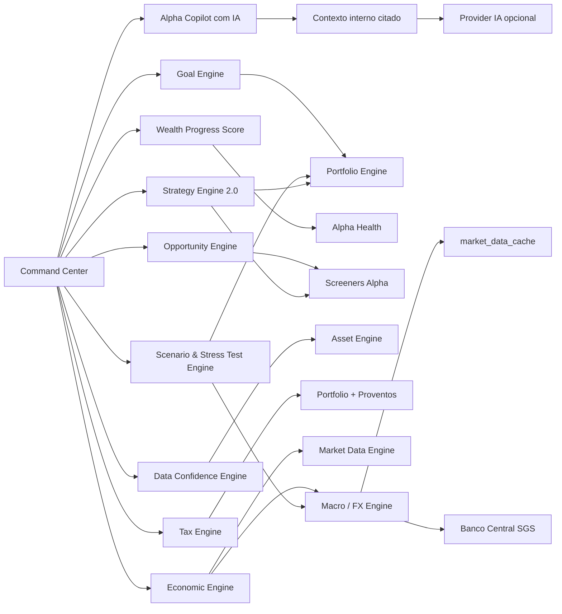
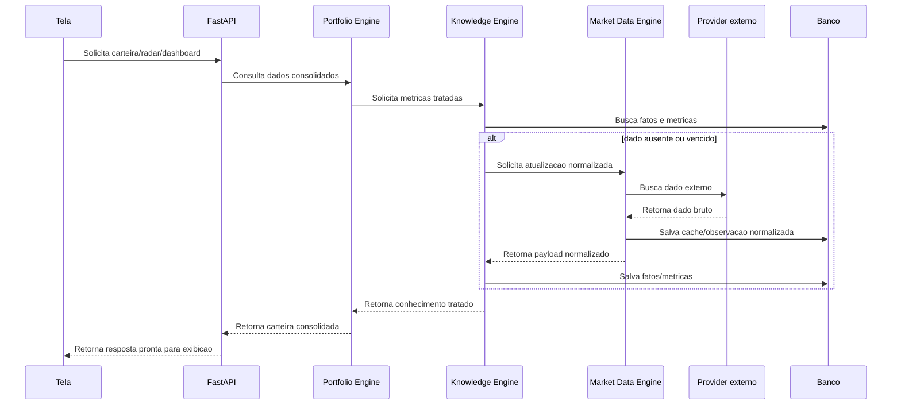

# Diagrama de Arquitetura - Carteira Alpha 360

Status: diagrama conceitual da Fase 1.

```mermaid
flowchart TB
    User["Usuario"] --> Frontend["Frontend React"]
    Frontend --> API["FastAPI REST API"]
    Frontend --> PremiumUI["Tela Research Premium"]

    API --> Auth["Auth / Multiusuario"]
    API --> Portfolio["Global Portfolio Engine"]
    API --> WealthOS["Alpha Wealth OS"]
    API --> Recommended["Recommended Portfolio Engine"]
    API --> TotalReturn["Total Return Engine"]
    API --> Wealth["Wealth Builder"]
    API --> Guardian["Guardian"]
    API --> Copilot["Alpha Copilot"]
    API --> Ops["Ops / Observability"]
    API --> Premium["Alpha Premium Research"]
    API --> PremiumAdmin["Premium Research Admin API"]
    API --> Billing["Payment Gateway API"]
    API --> Distribution["Distribution Engine API"]
    PremiumUI --> PremiumAdmin

    Portfolio --> AssetEngine["Asset Engine Universal"]
    Portfolio --> Money["FX / Money Engine"]
    Portfolio --> Knowledge["Knowledge Engine"]
    Portfolio --> Strategy["Strategy Engine 2.0"]
    Portfolio --> TotalReturn

    Wealth --> Portfolio
    Wealth --> Money
    WealthOS --> Portfolio
    WealthOS --> Wealth
    WealthOS --> Guardian
    WealthOS --> Copilot
    WealthOS --> Knowledge
    Guardian --> Portfolio
    Guardian --> Knowledge
    Guardian --> Strategy
    Copilot --> Portfolio
    Copilot --> Knowledge
    Copilot --> Strategy
    Copilot --> Guardian

    Knowledge --> MarketData["Market Data Engine"]
    Strategy --> Knowledge
    Strategy --> AssetEngine
    Recommended --> Strategy
    Recommended --> Knowledge
    Recommended --> MarketData
    Recommended --> Portfolio
    Recommended --> Governance["Recommendation Governance Engine"]
    Governance --> Confidence2["Data Confidence Engine V2"]
    Governance --> UserPrefs["user_preferences"]

    Premium --> Publisher["Alpha Research Publisher"]
    PremiumAdmin --> Publisher
    PremiumAdmin --> Thesis
    PremiumAdmin --> Rating
    PremiumAdmin --> Committee
    PremiumAdmin --> Attribution
    PremiumAdmin --> Snapshot
    PremiumAdmin --> Reviews["publication_reviews"]
    PremiumAdmin --> Approvals["publication_approvals"]
    Publisher --> PubTables["research_publications / versions / sections / evidence"]
    Premium --> Thesis["Thesis Engine"]
    Thesis --> ThesisTables["asset_theses / versions / evidence"]
    Premium --> Rating["Rating Engine"]
    Rating --> RatingTables["asset_ratings / versions / evidence"]
    Premium --> Committee["Alpha Research Committee"]
    Committee --> CommitteeTables["research_committee_runs / gates / votes"]
    Premium --> Attribution["Performance Attribution Engine"]
    Attribution --> AttributionTables["research_attribution_runs / assets"]
    Premium --> Snapshot["Publication Snapshot Engine"]
    Snapshot --> SnapshotTables["publication_snapshots"]
    Premium --> Render["Publication Render Engine"]
    Snapshot --> Render
    Render --> ArtifactTables["publication_artifacts"]
    Render --> DataLineage
    Premium --> Pdf["Publication PDF Publisher"]
    Render --> Pdf
    Pdf --> ArtifactTables
    Pdf --> DataLineage
    Pdf --> Entitlements
    Premium --> Publication["PDF / Web Publisher"]
    Premium --> Entitlements["Premium Entitlements Engine"]
    Entitlements --> EntitlementTables["subscription_plans / user_subscriptions / premium_entitlements / premium_access_logs"]
    Premium --> RBAC["Premium RBAC"]
    RBAC --> RBACTables["user_roles"]
    Premium --> SubscriberArea["Area Premium do Assinante"]
    SubscriberArea --> Entitlements
    SubscriberArea --> RBAC
    SubscriberArea --> Billing
    SubscriberArea --> DeliveryInbox["Subscriber Delivery Inbox"]
    Billing --> BillingTables["billing_checkout_sessions / transactions / webhook_events"]
    Billing --> Entitlements
    PremiumAdmin --> Distribution
    Distribution --> DistributionTables["distribution_campaigns / recipients / event_logs"]
    Distribution --> DistributionProviders["Distribution Providers mock / resend / smtp"]
    Distribution --> EmailTemplates["Premium Email Templates"]
    DeliveryInbox --> DistributionTables
    DeliveryInbox --> EntitlementTables
    DeliveryInbox --> ArtifactTables
    Distribution --> Entitlements
    Distribution --> ArtifactTables
    Premium --> Compliance["Compliance & Disclosure"]
    Publisher --> Recommended
    Publisher --> WealthOS
    Publisher --> Confidence2
    Publisher --> DataLineage["Data Lineage & Evidence Ledger"]
    Publisher --> Thesis
    Thesis --> DataLineage
    Publisher --> Rating
    Rating --> Thesis
    Rating --> DataLineage
    Publisher --> Committee
    Committee --> Thesis
    Committee --> Rating
    Committee --> DataLineage
    Committee --> Strategy
    Committee --> Guardian
    Committee --> Knowledge
    CommitteeTables --> DB
    Attribution --> TotalReturn
    Attribution --> MarketData
    Attribution --> DataLineage
    AttributionTables --> DB
    EntitlementTables --> DB
    RBACTables --> DB
    BillingTables --> DB
    DistributionTables --> DB
    Snapshot --> PubTables
    Snapshot --> CommitteeTables
    Snapshot --> AttributionTables
    Snapshot --> DataLineage
    SnapshotTables --> DB
    Publication --> DataLineage
    PubTables --> DB
    Reviews --> DB
    Approvals --> DB

    MarketData --> Cache["Cache / Observations"]
    MarketData --> BRAPI["BRAPI"]
    MarketData --> CVM["CVM"]
    MarketData --> B3["B3"]
    MarketData --> CMC["CoinMarketCap"]
    MarketData --> CG["CoinGecko"]
    MarketData --> AV["Alpha Vantage"]
    MarketData --> FH["Finnhub"]
    MarketData --> TD["Twelve Data"]
    MarketData --> FXP["Banco Central / FX Provider"]

    AssetEngine --> DB["PostgreSQL / SQLite local"]
    Knowledge --> DB
    Portfolio --> DB
    TotalReturn --> DB
    Strategy --> DB
    Governance --> DB
    Money --> DB
    Guardian --> DB
    Auth --> DB
    Ops --> Audit["audit_events"]
    Ops --> Jobs["job_runs"]
    Ops --> Logs["JSON Logs / Metrics"]
    Audit --> DB
    Jobs --> DB
```

## Wealth OS

## Fluxo de dado ideal

## Regra visual

Este diagrama nao altera telas. Ele orienta como as proximas implementacoes devem reorganizar dependencias internas.
